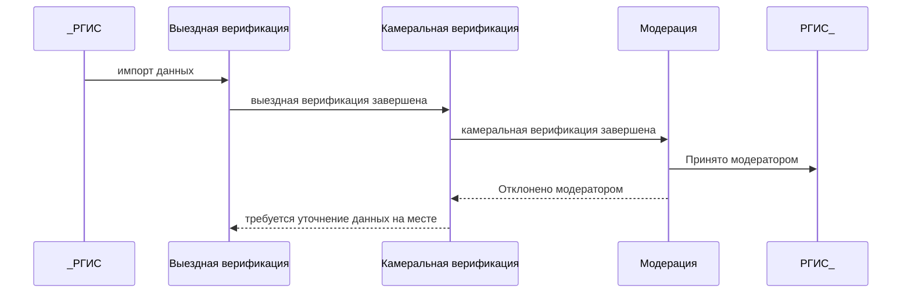
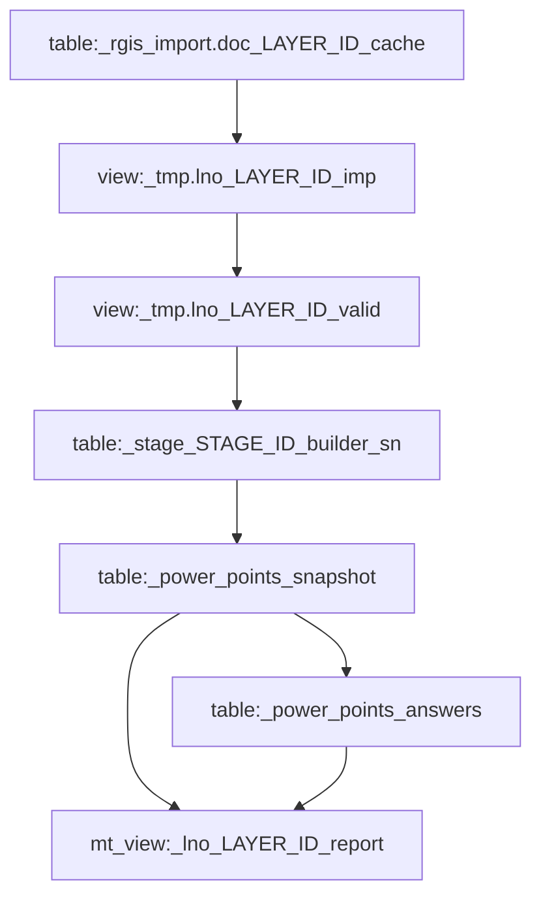

# Линии наружного освещения


[[_TOC_]]


## Готовность к запуску

### To-Do

- [x] Пользователи
  - [x] Добавить в роли недостающие стэйджи
  - [x] Добавить пользователей из второго файла
  - [x] Еще раз запустить по всем all_support()
  - [x] Везде подставить новую функцию по работе с координатами
  - [x] Исправлены номера слоев в снапшоте. 
- [x] Задания
  - [x] Затереть стэйджбилдеры
  - [x] Затереть Снапшот
  - [x] Затереть Ансверы
- [x] Документация
  - [x] Перерисовать схему данных
- [ ] Перезапустить задания
- [ ] Вывести отчеты в Веб


### Скрипты

| Задачи:                                   | 533 | 1015 | 493 | 495 |
| :---------------------------------------- | :--: | :--: | :--: | :--: |
| Настроен импорт                           |  ✅  |  ✅  |  ✅  |  ✅  |
| Настроено представление                   |  ✅  |  ✅  | ✅ | ✅ |
| Созданы компании                          |  ✅  |  ✅  |  ✅ |  ✅ |
| Созданы проекты по 3м этапам              |  ✅  |  ✅  | ✅ | ✅ |
| Созданы фильтры по 3м этапам              |  ✅  |  ✅  | ✅ | ✅ |
| Готова вьюха с валидными записями         |  ✅   | ✅ | ✅ | ✅ |
| ⏱ Скрипт наполнения запуска реестра заданий |  ✅   | ✅ | ✅ | ✅ |
| ⏱ Скрипт настройки первого этапа          |  ✅   | ✅ | ✅ | ✅ |
| ⏱ Скрипт настройки второго этапа          |  ✅   | ✅ | ✅ | ✅ |
| Написан отчет                             |  ✅   | ✅ | ✅ | ✅ |
| Задания запущены                          |  ⌛️   | ⌛️ | ⌛️ | ⌛️ |
| Все ⏱ скрипты на Хроне                    | ✅ | ✅ | ✅ | ✅ |
| Отчеты в вебе                             | 🏞 | 🏞 | 🏞 | 🏞 |


### Названия этапов разделенные по слоям

|  | ID | Название |
| :- | :-: | : - |
| **Слой РГИС** | **495** | **Сведения о линиях наружного освещения** |
| 1й Этап Верефикации | 1959 | Сведения о линиях наружного освещения 1ый этап верификации |
| 2й Этап Верефикации | 2006 | Сведения о линиях наружного освещения 2ой этап верификации |
| Модерация | 2009 | Модерация задания «Сведения о линиях наружного освещения» |
| **Слой РГИС** | **533** | **Сведения о пунктах питания наружного освещения** |
| 1й Этап Верефикации | 1956 | Сведения о пунктах питания наружного освещения 1ый этап верификации |
| 2й Этап Верефикации | 1957 | Сведения о пунктах питания наружного освещения 2ой этап верификации |
| Модерация | 1958 | Модерация задания «Сведения о пунктах питания наружного освещения» |
| **Слой РГИС** | **493** | **Сведения о светильниках и опорах наружного освещения** |
| 1й Этап Верефикации | 2005 | Сведения о светильниках и опорах наружного освещения 1ый этап верификации |
| 2й Этап Верефикации | 2008 | Сведения о светильниках и опорах наружного освещения 2ой этап верификации |
| Модерация | 2010 | Модерация «Сведения о светильниках и опорах наружного освещения» |
| **Слой РГИС** | **1015** | **Сведения об объектах архитектурн**о-художественной подсветки (АХП) |
| 1й Этап Верефикации | 2011 | Сведения об объектах архитектурно-художественной подсветки (АХП) 1ый этап верификации |
| 2й Этап Верефикации | 2013 | Сведения об объектах архитектурно-художественной подсветки (АХП) 2ой этап верификации |
| Модерация | 2015 | Модерация задания «Сведения об объектах архитектурно-художественной подсветки (АХП)» |


## Введение

### Цели и задачи

Целью выполнения работ является осуществление контроля за проведением верификации систем наружного освещения с применением МП и сценариев проведения обследования объектов СНО и АХП органов местного самоуправления Московской области (далее – ОМСУ), по которым информация о системах наружного освещения муниципальных образований Московской области внесена в слои РГИС

### Исполнители

| Роль     | ФИО             | Telegram         | email |
| -------- | --------------- | ---------------- | ----- |
| Менеджер | Азарова Татьяна | +7 916 074-61-48 |       |
| Аналитик | Арутунян Георгий | @ArutunyanGV | arutunyan.gv@mosreg.ru |


### Роли пользователей МП

*   Роль **«Исполнитель ОМСУ»** (далее - Исполнитель) - сотрудник структурного подразделения ОМСУ (подведомственной организации, эксплуатирующей организации), осуществляющий верификацию объектов СНО и АХП;
*   Роль **«Диспетчер ОМСУ»** (далее - Диспетчер) - сотрудник структурного подразделения ОМСУ (подведомственной организации, эксплуатирующей организации), осуществляющий модерацию задания по верификации объектов СНО и АХП, ответственный за внесение сведений о СНО и АХП в слои РГИС

### Компании

Компании формируются по ОМСУ

## Реализация

### Алгоритм перехода заданий



### Структура данных

#### Слои и Этапы

| Слой — LAYER_ID      | 533  | 1015 | 493  | 495  |
| -------------------- | :--: | :--: | :--: | :--: |
| 1я Верификация — МП  | 1956 | 2011 | 2005 | 1959 |
| 2я Верефикация — WEB | 1957 | 2013 | 2008 | 2006 |
| Модерация — WEB      | 1958 | 2015 | 2010 | 2009 |

#### Схема данных:




### Слои РГИС


Слои РГИС можно посмотреть по ссылке: <http://int.rgis.mosreg.ru>
| ID   | Название                                                     |
| ---- | ------------------------------------------------------------ |
| 493  | Сведения о светильниках и опорах наружного освещения         |
| 495  | Сведения о линиях наружного освещения                        |
| 533  | Сведения о пунктах питания наружного освещения               |
| 1015 | Сведения об объектах архитектурно-художественной подсветки (АХП) |

Ссылка на экспорт данных предоставленная РГИС: <http://int.rgis.mosreg.ru/openapi/rgis/data/doc/>
```sql
select * from rgis_import.metadata
where external_id in (493, 495, 533, 1015)
order by external_id asc
```


### Реестры Импорта

```sql
select external_id, status_cd, entity_id
from rgis_import.metadata
where external_id in (493, 495, 533, 1015)
order by external_id asc
```

| rigs_id | Обнов. | entity_id |
| ------- | ------ | --------- |
|493|2|5450|
|495|2|5448|
|533|2|5449|
|1015|2|5447|

### Данные приходят в следующие реестры

```sql
select id, table_name, view_name 
from md_entity
where id in (5450, 5448, 5449, 5447)
order by id asc
```

| id   | table_name | view_name |
| ---- | ---------- | --------- |
|5447|rgis_import.doc_1015_cache|Сведения об объектах архитектурно-художественной подсветки (АХП)|
|5448|rgis_import.doc_495_cache|Сведения о линиях наружного освещения|
|5449|rgis_import.doc_533_cache|Сведения о пунктах питания наружного освещения|
|5450|rgis_import.doc_493_cache|Сведения о светильниках и опорах наружного освещения|

### Читаемые представления данных

```sql
select * from tmp.lno_1015_imp;
select * from tmp.lno_495_imp;
select * from tmp.lno_533_imp;
select * from tmp.lno_493_imp;
```

* [lno_import.sql](lno_import.sql)

### Валидные представления по которым будут создаваться задания

```sql
select * from tmp.lno_1015_valid;
select * from tmp.lno_495_valid;
select * from tmp.lno_533_valid;
select * from tmp.lno_493_valid;
```

* [lno_import_to_valid.sql](lno_import_to_valid.sql)

Условия отбраковки исходных данных:

* `check_ = 'да'`
* `geo is not null`
* `omsu ilike '%' || alias.name || '%'`


### Таблицы

```sql
select id, table_name, view_name
from md_entity
where table_name ilike 'power_points_%'
order by id asc
```

| id   | table_name            | view_name           |
| ---- | --------------------- | ------------------- |
| 5457 | power_points_snapshot | ЛНО. Таблица фактов |
| 5473 | power_points_answers  | ЛНО. Ответы         |


### Задачи на дата процессоре

```sql
select * from data_processor where name ilike 'ЛНО — %'
```


| id | name | schedule|
| ---- | ---- | ---- |
| 638 | ЛНО — Наполнение Stage Builder | 24 4 * * * |
| 637 | ЛНО — Запуск Заданий — 495 — 1959 | 34 4 * * * |
| 636 | ЛНО — Запуск Заданий — 493 — 2005 | 34 4 * * * |
| 635 | ЛНО — Запуск Заданий — 1015 — 2011 | 34 4 * * * |
| 634 | ЛНО — Запуск Заданий — 533 — 1956 | 34 4 * * * |
| 639 | ЛНО — Открытие Заданий + Инсерт Ансверов | 44 * * * * |

### Создание заданий

* [lno_fill_stage_builders.sql](lno_fill_stage_builders.sql)


```sql
select * from stage_1959_builder_sn;
select * from stage_2005_builder_sn;
select * from stage_2011_builder_sn;
select * from stage_1956_builder_sn;
```


### Открытие заданий

* [lno_open_executions_add_answers.sql](lno_open_executions_add_answers.sql)

Просмотреть компоненты заданий:

```sql
select
qch.id,
       qch.name,
       q.id,
       q.title,
       qcom.id,
       qcom.component_type,
       qcom.header,
       qcom.required,
       qcom.*
from question_chain qch
         join question q on qch.id = q.question_chain_id
         join question_component qcom on q.id = qcom.question_id
where qch.stage_id in (1959)
order by q.position, qcom.position, q.id
```


## Результаты

### Отчеты

* [lno_report.sql]()

### Веб отчет


